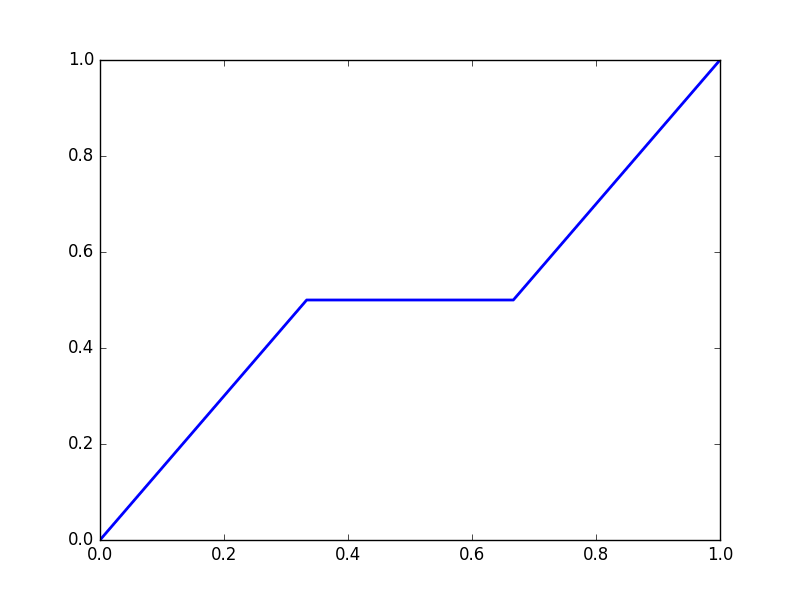
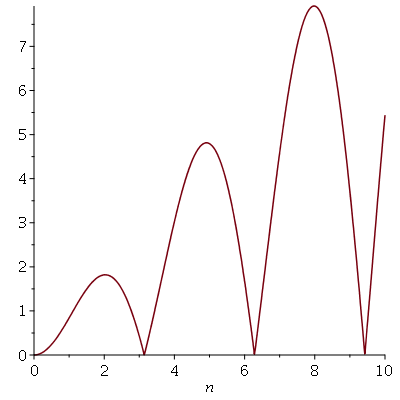

 Below are some fun animations I've done recently using Matplotlib, Python, and Maple.

### Animation of Jacob Bernoulli's Solution to the Harpsichord Problem 

Plot of $$u(x,t)$$ with initial condition $$u(x,0) = f(x),$$ $$\frac{\partial u}{\partial t} \bigg|_{t = 0} = 0,$$ and initial condition $$f(x) = \begin{cases} x \text{ for } 0 \leq x \leq \frac{\pi}{2} \\ \pi - x \text{ for } \frac{\pi}{2} \leq x \leq \pi \end{cases}$$

Code can be found <a href="https://gist.github.com/marshareb/777745fb6f38831eeffc2771bcf5c32d">here</a>.

### Animation of the Devil's Staircase (Cantor Function) 

Define $$C_0 = [0,1],$$ and $$C_k = \frac{C_{k-1}}{3} \bigcup \left(\frac{C_{k-1}}{3} + \frac{2}{3} \right).$$ Then $$C = \bigcap_{k=1}^{\infty}C_k$$ is called the Cantor set. We define the Cantor function as follows; let $$D_k = [0,1] \setminus C_k.$$ Then we may write D_k as a union of non-overlapping open intervals; notationally, we have $$D_k = \bigcup_{j=1}^{2^n-1} (I_j^n)^{\mathscr{o}}.$$ Order these intervals in the natural way, where $$\max(I_j) \leq \min (I_{j+1}).$$ Define a function $$f_n(x) = \begin{cases}\frac{j}{2^n} \text{ if } x \in (I_j^n)^{\mathscr{o}} \\ \frac{1}{2^n(\min(I_j^n) - \max(I_{j-1}^n))}x + \frac{\max(I_{j-1}^n) \frac{j}{2^n} - \min(I_j^n) \frac{j-1}{2^n}}{\max(I_{j-1}^n) - \min(I_j^n)} \ \text{ if } \max(I_{j-1}^n) \leq x \leq \min(I_j^n) \\ \text{linear between 0 and }I_1^n \text{ and 1 and }I_{2^n-1}^n \end{cases}$$ 
Notice that for each n, we have 
$$ |f_{n+1}(x) - f_n(x)| < 2^{-n} \ \forall x \in [0,1]$$
and so we have f_n uniformly converges to a function f called the Cantor-Lebesgue function. It is animated below for 
$$ 0 \leq n < 10.$$

Code can be found <a href="https://gist.github.com/marshareb/9e3e2196bcf4c0847429b49b4365b953">here</a>.

### Animation of Convergence of Simple Functions 
We define a simple function f to be a function which takes a finite number of (finite) values over the reals (to whatever dimension). We have a theorem which says for a function f which is always positive, we can create a sequence of simple functions which increase to the function, via setting $$f_n(x) = \sum_{j=1}^{n 2^n} \left( \left(\frac{j-1}{2^n}\right) \chi_{\{\frac{j-1}{2^n} < f \leq \frac{j}{2^n} \} } \right) + n \chi_{\{f \geq n\}}.$$ To show this, I created a sequence of functions following this definition which converges to $$f(x) = |x\sin(x)|.$$ You can see below the convergence for 1 <= n <= 8.

 

 
The target function is shown below.

 

  
Created using Maple.
	
